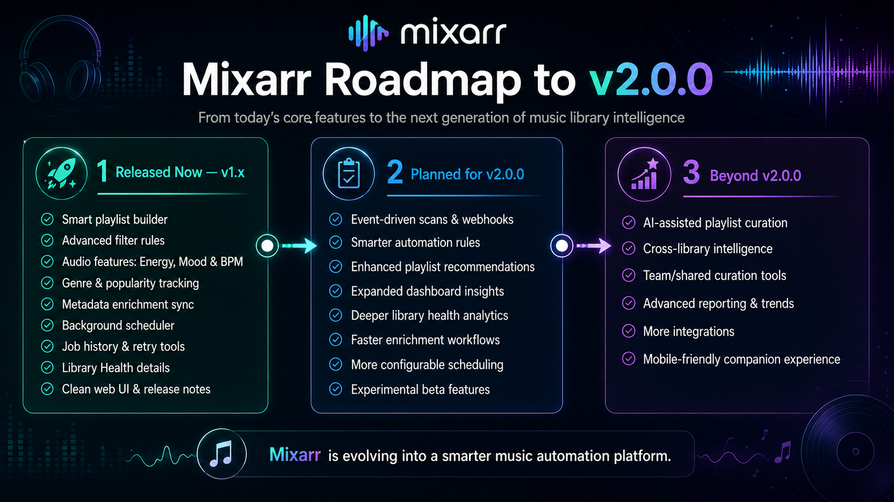
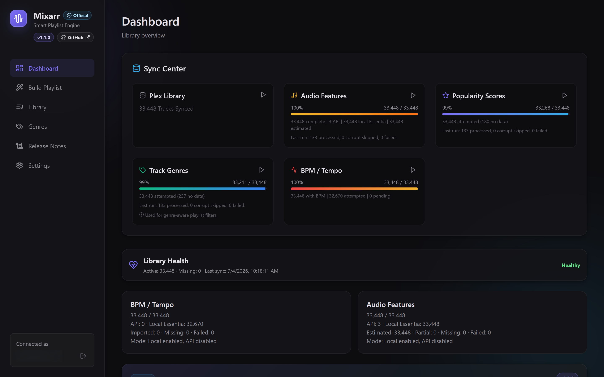
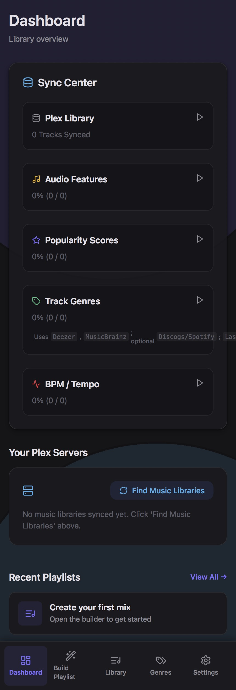
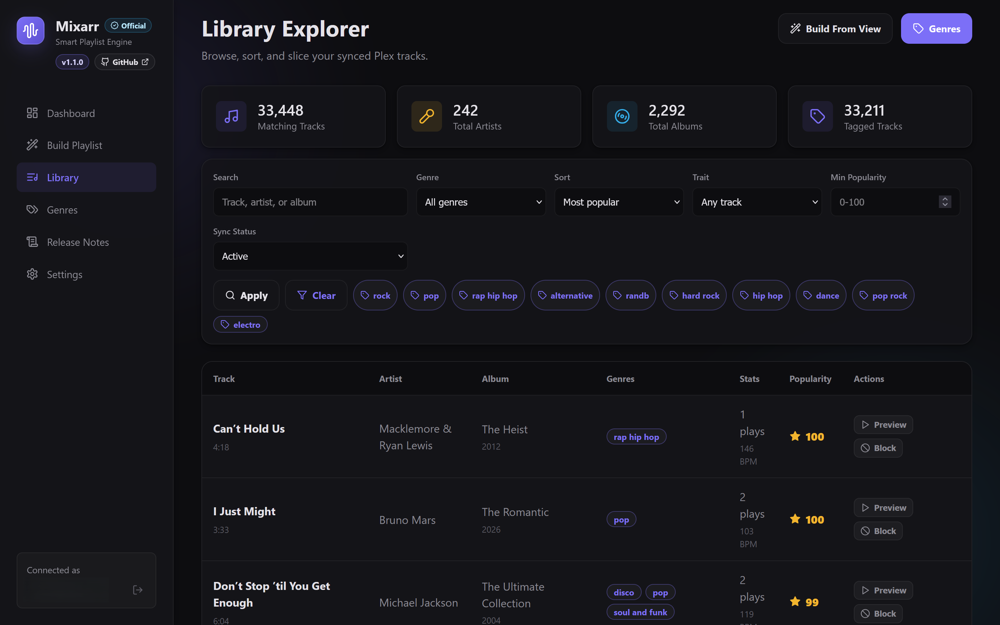
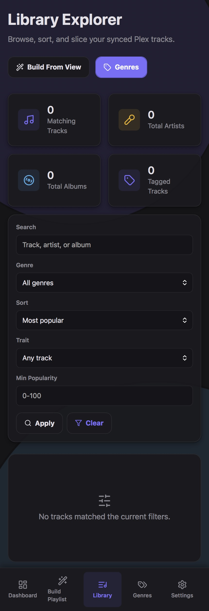
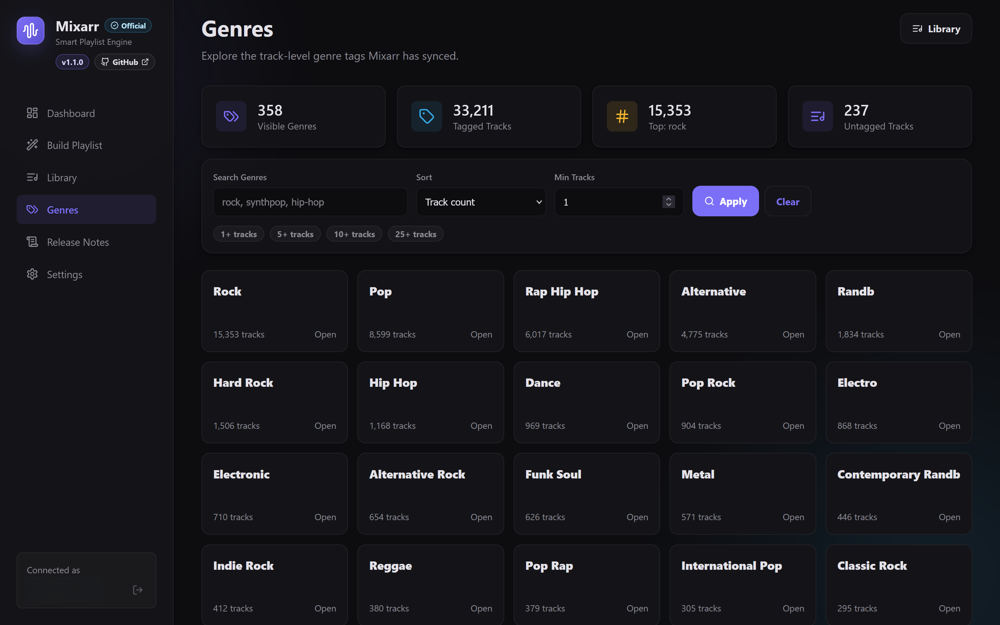
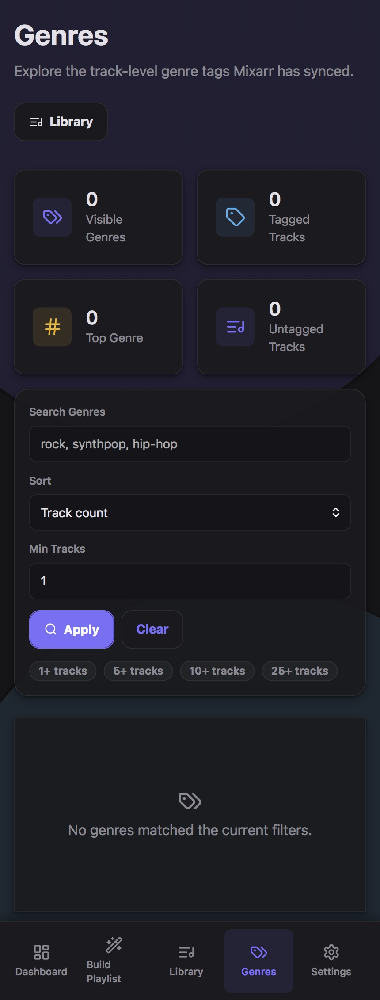
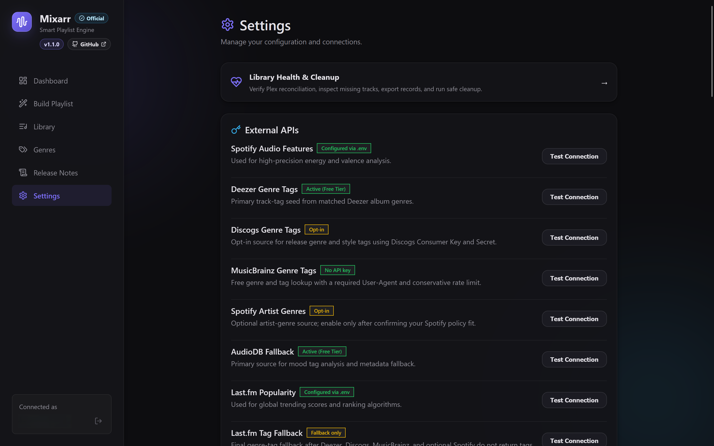
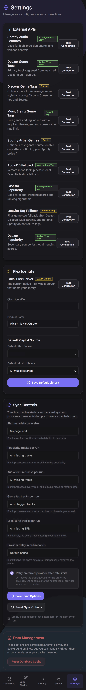

# Mixarr

Current release: **v2.4.5 — Mood, Activity and Intent Intelligence**. See [the v2.4.5 guide](docs/MOOD_ACTIVITY_INTENT_INTELLIGENCE_V245.md) for local-first natural-language intent, editable phases, energy/BPM curves, privacy-safe custom terminology, presets, and deterministic generation.

**Mixarr** is a self-hosted Plex music playlist and library enhancement app for people who want smarter ways to explore, repair, and playlist their Plex music libraries.

[](https://discord.gg/B7xMvAhaF)

Mixarr connects to your Plex music library, syncs artists/albums/tracks into a local database, and helps build smarter playlists using metadata, genres, moods, energy, BPM, popularity, and audio analysis. It is designed for self-hosted Plex music users who want more control than static playlists can provide.

Docker upgrades run a non-destructive Prisma preflight before `db push`. Mixarr v2.3.6 adds optional household collaboration, fair shared personalization, guest profiles, voting, approvals, and family-friendly rules; existing playlists remain Individual. Never use `prisma db push --force-reset` on an existing Mixarr database.

## Roadmad to V2.0.0 & Beyond



## Beta / Experimental Notice

Mixarr is actively developed and several features are still beta or experimental. Bugs, edge cases, provider rate limits, failed audio samples, and incomplete metadata handling may happen, especially on large or unusual libraries.

Please report bugs, logs, feature requests, and test results in the Mixarr beta Discord:

[https://discord.gg/B7xMvAhaF](https://discord.gg/B7xMvAhaF)

Mixarr is not affiliated with Plex. Back up important playlists and settings before testing beta features or large repair/backfill jobs.

## Current Features

| Area | What Mixarr does today |
| --- | --- |
| Plex library connection | Connects to Plex, imports music libraries, and stores artists, albums, tracks, tags, and library state locally. |
| Smart playlist generation | Builds playlists from rules such as genre, artist, album, year, popularity, BPM, energy, mood, danceability, and more. |
| Household collaboration | Opt-in shared playlists combine selected members and guests with visible normalized influence, deterministic conflict handling, fairness caps, family rules, voting, approvals, contribution explanations, and activity history. |
| Push to Plex | Exports generated playlists back to Plex and supports saved playlist refresh flows. |
| Dashboard operations | Prioritizes library readiness, active work, Recently Added discovery, common playlist actions, automation, and compact Plex server status while keeping product previews secondary. |
| Library browsing | Provides searchable library and genre views for synced Plex music. |
| Track genre tools | Syncs, filters, inspects, and retries track-level genre metadata from supported providers. |
| Playlist-use tracking | Tracks playlist generation/export history and saved playlist refresh activity. |
| Playback awareness | Optionally imports per-user Plex listening history and applies confidence-limited recent-play, completion, replay, skip, forgotten-favorite, and discovery adjustments. |
| Contextual Mixes | Turns time, day, season, and activity contexts into visible, editable Smart Mix v2 energy, discovery, mood, BPM, and variety settings. |
| Playlist Coordination | Relates Smart Mix playlists, measures canonical overlap, limits accidental reuse, supports shared cores and progression chains, and balances tracks and artists across a group. |
| Playlist Collections | Organizes playlists into reusable groups with multiple memberships, shared defaults and exclusions, primary-group inheritance, explainable health, ordering, pause/resume, cloning, and bounded group regeneration. |
| Smart Mix explanations | Shows why v2 tracks were selected or rejected, separates score from confidence, compares candidates, explains transitions and fallbacks, and summarizes generation-wide decisions. |
| Advanced playlist regeneration | Analyzes Smart Mix v2 playlists, locks keeper tracks, previews targeted replacements, preserves curves, and supports server-side undo. |
| Playlist version history | Saves generated playlist states, compares tracks/settings/scores, pins restore points, and safely restores earlier versions without deleting later history. |
| Smart Refresh Scheduling | Evaluates quality, compatible tracks, playback repetition, identity drift, relevant metadata, and safeguards before previewing or applying a meaningful refresh. |
| Smart Experiments | Compares protected Smart Mix variants, tracks independent feedback and optional playback signals, suggests an explainable winner, merges settings, and restores the original snapshot. |
| Playlist Health | Continuously scores generated playlists and alerts on identity drift, repetition, concentration, broken Plex links, unavailable tracks, metadata decline, BPM or mood conflicts, staleness, and failed automation. |
| Playlist Ecosystem | Unifies managed-playlist health, group status, relationships, overlap, coverage, jobs, Smart Actions, experiments, trends, audit activity, onboarding, configuration transfer, and backup readiness. |
| Recently Added Automation | Detects new Plex tracks once, scores readiness, quarantines incomplete analysis, suggests Smart Mix matches, and optionally applies version-protected additions after explicit opt-in. |
| BPM detection and backfill | Uses API metadata where available, with local fallback support for missing or partial BPM data. |
| Audio feature analysis | Stores energy, mood/valence, danceability, acousticness, tempo, source, status, and confidence fields. |
| API metadata support | Uses providers such as Deezer, Last.fm, MusicBrainz, Discogs, Spotify, and AudioDB where configured and available. |
| Retry and repair tools | Provides targeted retry/backfill tools for missing or partial genre, popularity, BPM, and audio-feature data. |
| Library health views | Surfaces missing tracks, active/missing counts, metadata coverage, failure reasons, retry queues, and cleanup tools. |
| Background jobs | Runs sync, metadata, playlist refresh, and analysis jobs with progress logging and overlap protection. |
| Docker deployment | Ships with Docker and Docker Compose support for self-hosted installs. |
| AI provider foundation | Optionally configures provider-neutral local or remote AI connections, encrypted credentials, model discovery, health, budgets, and safe audits. AI and all future features are disabled by default, and no AI endpoint can mutate playlists. |

## Beta and Experimental Features

Mixarr v2.3.6 adds optional household collaboration. See [Household Collaboration](docs/HOUSEHOLD_COLLABORATION_V236.md), [Community Recipe Sharing](docs/COMMUNITY_RECIPE_SHARING_V235.md), [Curated Recipe Library](docs/CURATED_RECIPE_LIBRARY_V234.md), [Recipe Inheritance & Overrides](docs/RECIPE_INHERITANCE_V233.md), [Adaptive Recipe Mapping](docs/ADAPTIVE_RECIPE_MAPPING_V232.md), [Recipe Import & Export](docs/RECIPE_IMPORT_EXPORT_V231.md), and [Mix Recipe Foundation](docs/MIX_RECIPES_V230.md).

These features exist in the current beta, but are still being tested across different libraries, platforms, and file layouts:

| Feature | Status |
| --- | --- |
| Local Essentia BPM analysis | Experimental. Uses Essentia when available, with Aubio fallback on unsupported or unavailable setups. |
| Local Essentia audio-feature analysis | Experimental. Can analyze local audio for energy, mood/valence, danceability, acousticness, and related confidence data. |
| Multi-window and whole-track analysis modes | Beta. Useful for improving BPM/audio-feature coverage, but can be slower and CPU-heavy. |
| BPM and audio-feature confidence scoring | Beta. Confidence values are useful signals, not final truth. |
| Provider preference controls | Beta. API/local provider toggles and retry behavior are still being refined. |
| Library Health cleanup and repair tools | Beta. These tools are helpful, but review selections carefully before cleanup actions. |
| Automated saved playlist refresh | Beta. Background refresh jobs include locking/protection, but playlist automation should still be tested carefully. |
| Metrics and progress reporting | Beta. Useful for troubleshooting, but labels and coverage may continue to evolve. |
| Advanced playlist regeneration | Beta. Review every proposed replacement before applying; aggressive sensitivity can substantially change a playlist. |
| Recently Added Automation | Beta and disabled by default. Suggestions work manually; automatic playlist changes, schedules, publishing, and notifications each require explicit opt-in. |
| Playback awareness | Beta and disabled by default. Requires an explicit Plex user mapping; skip inference is conservative and depends on the history fields supplied by the Plex server. |
| Contextual Mixes | Enabled by default. Suggestions use only configured local time/day and never infer activities or use location data. |

## Getting Started

1. Clone this repository.
2. Copy `.env.example` to `.env`.
3. Fill in the Plex settings and any optional provider keys you want to use.
4. Start the stack:

```bash
docker-compose up -d --build
```

If your Docker setup uses Compose v2, this command may also work:

```bash
docker compose up -d --build
```

Open Mixarr at:

```text
http://localhost:3000
```

From there, connect Plex, choose your music library, start a metadata sync, and use the dashboard/settings tools to run optional metadata, BPM, genre, popularity, and audio-feature jobs.

## Configuration Notes

Most users should start with `.env.example` and only change the values they need. Provider keys are optional, but more configured providers can improve metadata coverage.

### Plex

```env
PLEX_CLIENT_IDENTIFIER=your-random-uuid-here
PLEX_PRODUCT_NAME="Mixarr Playlist Curator"
PLEX_OAUTH_CALLBACK_URL=http://localhost:3000/auth/callback
```

### Providers

Mixarr can use external providers where available and configured:

| Provider | Used for |
| --- | --- |
| Deezer | BPM, popularity, genre metadata |
| Last.fm | Popularity and final-fallback genre tags |
| MusicBrainz | Genre/tag metadata |
| Discogs | Optional genre/style metadata |
| Spotify | Optional popularity/audio metadata and artist genres where enabled |
| AudioDB | Audio-feature metadata where available |

Provider APIs can be rate-limited, unavailable, incomplete, or inconsistent. Mixarr records source/status information so you can inspect and retry partial results.

### Local BPM and Audio Analysis

Local analysis defaults are intentionally conservative:

```env
ENABLE_API_BPM=true
ENABLE_LOCAL_BPM=true
PREFER_LOCAL_BPM=false
REPROCESS_API_BPM_WITH_LOCAL=false
LOCAL_BPM_ANALYZER=auto
LOCAL_BPM_ANALYSIS_SCOPE=windows
LOCAL_BPM_CONCURRENCY=1
LOCAL_BPM_REPROCESS_AUBIO_WITH_ESSENTIA=0
LOCAL_BPM_REPROCESS_NO_DATA_FAILED=0

ENABLE_API_AUDIO_FEATURES=true
ENABLE_LOCAL_AUDIO_FEATURES=true
PREFER_LOCAL_AUDIO_FEATURES=false
REPROCESS_API_AUDIO_FEATURES_WITH_LOCAL=false
LOCAL_AUDIO_FEATURES_SCOPE=windows
LOCAL_AUDIO_FEATURES_CONCURRENCY=1
LOCAL_AUDIO_FEATURES_AUTO_BACKFILL=0
```

`LOCAL_BPM_ANALYZER=auto` prefers Essentia when available and falls back to Aubio. The default `windows` scope samples multiple portions of a track. `whole_track` can be more thorough, but is slower.

Automatic and manual Audio Features runs use the same saved provider settings. When local analysis is enabled, Essentia remains eligible as the preferred provider or as fallback when a preferred API cannot be used.

### Docker Media Path Mapping

For local BPM/audio analysis, the Mixarr container needs read access to the same media files Plex reports. These variables help rewrite Plex paths into container paths:

```env
PLEX_MEDIA_PATH_HOST=/mnt/Music
MIXARR_MEDIA_PATH_CONTAINER=/home/Mixarr/Music
MIXARR_PATH_MAPPINGS=/mnt/Music:/media
```

You also need the matching read-only Docker volume mount. For example, if Plex reports `/mnt/Music/...` but the Docker host stores files at `/mnt/plex/Music/...`, use:

```env
MIXARR_PATH_MAPPINGS=/mnt/Music:/media
```

And mount the real host folder into the container:

```yaml
volumes:
  - /mnt/plex/Music:/media:ro
```

## Database and Job Tuning

Mixarr keeps Prisma traffic conservative by default:

```env
MIXARR_DB_JOB_CONCURRENCY=4
MIXARR_GROUP_REGENERATION_CONCURRENCY=2
MIXARR_STATUS_CACHE_SECONDS=5
MIXARR_STATUS_POLL_SECONDS=10
MIXARR_STATUS_IDLE_POLL_SECONDS=30
```

For larger installs, Prisma supports connection-string parameters such as `connection_limit` and `pool_timeout`:

```env
DATABASE_URL=postgresql://mixarr:mixarrpass@db:5432/mixarrdb?schema=public&connection_limit=20&pool_timeout=20
```

Prefer lowering job concurrency and avoiding overlapping syncs before raising the pool size.

## Media Ecosystem Integrations

Mixarr v2.3.7 adds Plex ownership and collection workflows, manual-change reconciliation, scan/mount safety, Tautulli playback signals, Discord and Notifiarr delivery, signed webhooks, scoped dashboard tokens, Homepage, Home Assistant, Prometheus, and improved health endpoints. See [the v2.3.7 integration guide](docs/MEDIA_ECOSYSTEM_INTEGRATIONS_V237.md) for migration, configuration, endpoint, and troubleshooting examples.

Mixarr v2.3.9 adds a unified Recipe Studio with guided and advanced editing, live candidate and compatibility estimates, accessible energy/BPM tools, scoring and discovery previews, comparison, operational analytics, onboarding, optimistic save conflicts, mobile polish, and a reorganized roadmap. See [Recipe Studio & Release Polish](docs/RECIPE_STUDIO_V239.md). The v2.3.8 permission, signature, quarantine, governance, audit, snapshot, and restore systems remain authoritative; see [Recipe Safety, Compatibility & Governance](docs/RECIPE_GOVERNANCE_V238.md) and the [Recipe Author Guide](docs/RECIPE_AUTHOR_GUIDE_V238.md).

## AI Provider Foundation and Governance

Mixarr v2.4.0 adds optional provider-neutral infrastructure for Ollama, LiteLLM, LM Studio, DeepSeek, OpenAI API, generic OpenAI-compatible services, OpenRouter, and native Anthropic. v2.4.1 adds privacy, pricing, spending, token, request-volume, background, retry, reservation, alert, and usage controls. v2.4.2 adds the review-first Ask Mixarr workflow at `/ask-mixarr` and the Ollama Requests & User Policy hotfix. v2.4.3 gives native OpenAI its own Responses API adapter, model-compatibility filtering, cause-specific diagnostics, and separate credential, discovery, and inference health. Configure providers and explicitly enable the feature at `/settings/ai`. ChatGPT consumer subscriptions are not OpenAI API credentials and are not integrated through browser sessions or unofficial tokens.

AI is globally disabled after upgrade, and Mixarr makes no provider request until an administrator explicitly configures a provider and enables a feature. The default privacy policy is Metadata Limited with a restrictive allowlist; paid fallback, external background AI, and secure payload recording are off, while unknown external fields and unpriced external models are blocked. Local Ollama models are classified separately from external paid/unpriced models and do not require pricing or paid-provider permission. Ask Mixarr never sends credentials, file paths, server addresses, or full library inventories, and never selects final tracks. Set `AI_CREDENTIAL_ENCRYPTION_KEY` (or `MIXARR_SECRET_KEY`) before saving secret-based providers. See [AI Provider Foundation](docs/AI_PROVIDER_FOUNDATION_V240.md), [AI Privacy and Cost Controls](docs/AI_GOVERNANCE_V241.md), [v2.4.2 Governance Hotfix](docs/AI_GOVERNANCE_HOTFIX_V242.md), and [Natural-Language Playlist Requests](docs/NATURAL_LANGUAGE_PLAYLIST_REQUESTS_V242.md).

## Discord Community

Join the Mixarr beta Discord to report bugs, share feedback, and help test upcoming features:

[https://discord.gg/B7xMvAhaF](https://discord.gg/B7xMvAhaF)

Good feedback is especially useful for large libraries, unusual Plex metadata, Docker path-mapping issues, local Essentia/Aubio analysis, provider rate limits, and playlist refresh behavior.

## Reporting Bugs

When reporting an issue, please include as much of the following as possible:

- Mixarr version.
- Docker image/tag, if applicable.
- Plex music library size.
- What page you were on and what action you clicked.
- Whether the issue involves API metadata, local Essentia analysis, BPM, audio features, playlists, dashboard, or library health.
- Relevant logs from the Mixarr container.
- Screenshots, if they help explain the problem.
- Any provider settings or local analysis settings that seem relevant.

Please avoid posting secrets such as Plex tokens, API keys, database passwords, or private file paths you do not want to share.

## Product Roadmap

The v2.0.x Smart Mix Engine v2 cycle is complete. It delivered visible scoring, tuning, mood blending, BPM flow, discovery controls, advanced regeneration, playlist versions, manual metadata corrections, Recently Added automation, and advanced beta flags.

The v2.1.x Adaptive Personalization cycle is complete; v2.2.0 established deterministic Playlist Orchestration, v2.2.1 added Playlist Groups & Collections, v2.2.2 added Cross-Playlist Deduplication & Variety, v2.2.3 added multi-playlist journeys, and v2.2.4 adds explainable, estimate-gated Smart Refresh Scheduling. Optional AI-assisted planning remains separate long-term exploration; core generation and scheduling remain deterministic and provider-independent.

## Previews

### Dashboard

| Desktop | Mobile |
| :---: | :---: |
|  |  |

### Playlist Builder

| Desktop | Mobile |
| :---: | :---: |
|  |  |

### Library View

| Desktop | Mobile |
| :---: | :---: |
|  |  |

### Genres Page

| Desktop | Mobile |
| :---: | :---: |
|  |  |

### Settings and Integration

| Desktop | Mobile |
| :---: | :---: |
|  |  |

## Architecture

| Layer | Stack |
| --- | --- |
| Frontend | Next.js 14 App Router, React, CSS |
| Backend | Next.js route handlers, Node.js background workers |
| Database | PostgreSQL with Prisma ORM |
| Jobs | Sync, metadata, local analysis, playlist refresh, and scheduler jobs |
| Deployment | Docker and Docker Compose |

## Status

Mixarr is a serious self-hosted Plex music companion app, but it is still beta software. Expect active iteration, test carefully, and bring bugs or ideas to the Discord so the next version can get sharper.
